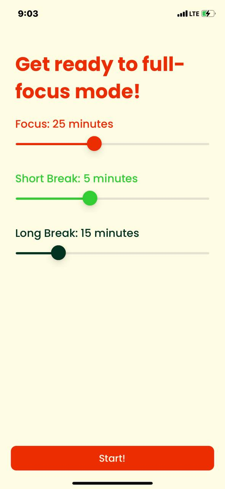
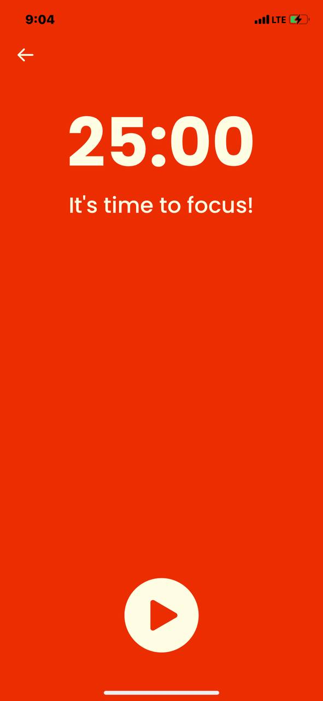
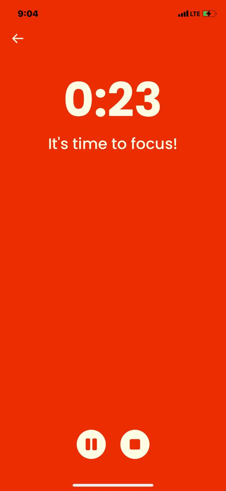

# Pomodoro Timer

This is an iOS application that provides a pomodoro timer with configurable focus, short-break and long-break times

Main features: The first page contains three sliders that can be dragged to change initial configuration of a timer to be set. Timer works in the following pattern: F S F S F S F L, where F is focus time, S is short break time, and L is a long break time. The app deals with asynchronous timers that execute the logic every second to work synchronously in a given pattern of a timer. 

